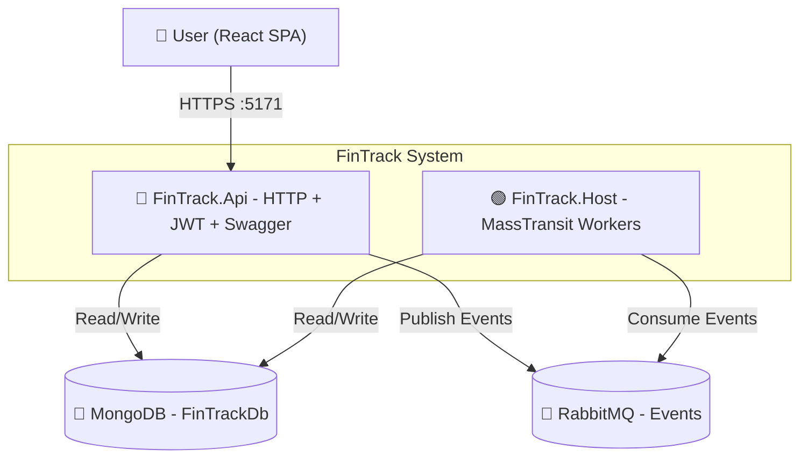
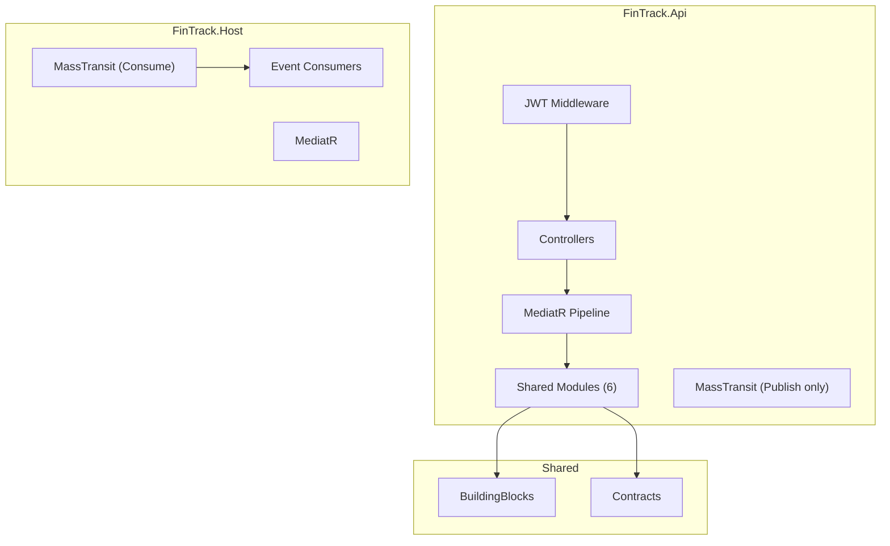
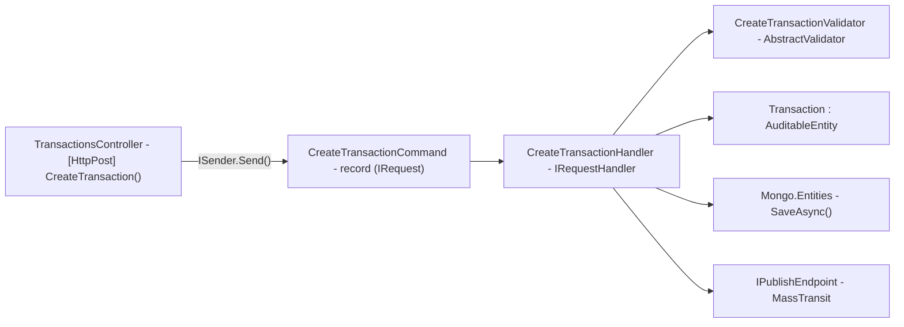

# 🏗️ FinTrack Architecture Blueprint

**Generated:** 2026-07-26 | **Version:** 1.0 | **Blueprint ID:** FT-ARCH-001

---

## 📋 Quick Navigation

| # | Section |
|---|---------|
| 1 | [Architecture Detection](#1-architecture-detection--analysis) |
| 2 | [Architectural Overview](#2-architectural-overview) |
| 3 | [Architecture Visualization](#3-architecture-visualization) |
| 4 | [Core Components](#4-core-architectural-components) |
| 5 | [Layers & Dependencies](#5-architectural-layers--dependencies) |
| 6 | [Data Architecture](#6-data-architecture) |
| 7 | [Cross-Cutting Concerns](#7-cross-cutting-concerns) |
| 8 | [Service Communication](#8-service-communication-patterns) |
| 9 | [.NET-Specific Patterns](#9-net-specific-architectural-patterns) |
| 10 | [Implementation Patterns](#10-implementation-patterns) |
| 11 | [Testing Architecture](#11-testing-architecture) |
| 12 | [Deployment Architecture](#12-deployment-architecture) |
| 13 | [Extension & Evolution](#13-extension--evolution-patterns) |
| 14 | [Code Examples](#14-architectural-pattern-examples) |
| 15 | [ADR — Decision Records](#15-architectural-decision-records-adr) |
| 16 | [Governance](#16-architecture-governance) |
| 17 | [New Dev Blueprint](#17-blueprint-for-new-development) |

---

## 1. Architecture Detection & Analysis

### Technology Stack

| Category | Technology | Version | Where |
|----------|-----------|---------|-------|
| **Runtime** | .NET | 10.0 | All `.csproj` files |
| **Language** | C# 14 | — | `.cs` files |
| **Web Framework** | ASP.NET Core (Controllers) | 10.0 | `FinTrack.Api` |
| **Database** | MongoDB + Mongo.Entities | 7.0 / 24.1 | `BuildingBlocks` |
| **Messaging** | MassTransit + RabbitMQ | 8.4 / 3.x | `FinTrack.Api`, `FinTrack.Host` |
| **Auth** | JWT Bearer + BCrypt | — | `Modules.Users` |
| **Validation** | FluentValidation | 12.1 | All modules |
| **Mediator** | MediatR | 14.1 | All modules |
| **Testing** | xUnit + FluentAssertions + NSubstitute | 2.9 / 8.2 / 5.3 | `tests/` |
| **Infrastructure** | Docker Compose | — | `docker-compose.yml` |

### Detected Architectural Pattern

**Primary:** Modular Monolith + Vertical Slice Architecture (VSA)

**Evidence:**
- 6 bounded-context modules as class libraries (`FinTrack.Modules.*`)
- No cross-module project references — only `BuildingBlocks` + `Contracts`
- Each module has `Features/{UseCase}/` folders with Command + Handler + Validator + Controller
- `internal` visibility on handlers; only `DependencyInjection.cs` is `public`
- Two deployable hosts (`Api` + `Host`) share the same module assemblies

**Secondary Patterns:**
- **CQRS** — Commands mutate, Queries read (via MediatR `IRequest<T>`)
- **Event-Driven** — Cross-module communication via MassTransit/RabbitMQ integration events
- **Result Pattern** — `BuildingBlocks.Result<T>` for operation outcomes

---

## 2. Architectural Overview

### Design Philosophy

FinTrack follows **Modular Monolith** principles: all business logic runs in-process within two deployable hosts (`Api` + `Host`), but modules are isolated by convention — not by network boundaries.

**Guiding Principles:**
1. **Module = Bounded Context** — Each module owns its data and logic. No shared entity types across modules.
2. **No Cross-Module References** — Communication only via integration events (RabbitMQ) or Contracts DTOs.
3. **Auth is a Hard Gate** — Global `[Authorize]` fallback. Only `Register`, `Login`, `RefreshToken` are anonymous.
4. **User-Scoped Data** — Every document stores `UserId`. All queries filter by `ICurrentUser`.
5. **Internal by Default** — Handlers, validators are `internal`. Only DI entrypoints and controllers are `public`.
6. **Vertical Slices** — One feature = one folder = one use case. No shared "Application Service" layer.

### Module Prominence Order

```
Dashboard → Transactions → Categories → Budgets → Accounts → Users
```

> Dashboard is the top product surface but is **read-only**. Users owns auth and ships first.

### Hybrid Pattern Adaptation

| Standard VSA | FinTrack Adaptation |
|-------------|-------------------|
| Feature folders with endpoint + handler + validator | With separate `Controllers/` folder per module |
| MediatR for command dispatch | All features use `ISender` |
| Domain folder per module | `Domain/` with Mongo.Entities entities |
| No cross-module references | Enforced via `.csproj` (no module→module ProjectReference) |

---

## 3. Architecture Visualization

### C4 — Context Diagram



### C4 — Container Diagram



### C4 — Component Diagram (Transactions Module)



---

## 4. Core Architectural Components

### 4.1 FinTrack.Api — HTTP Host

| Aspect | Detail |
|--------|--------|
| **Purpose** | Entry point for all HTTP traffic. No business logic. |
| **Framework** | ASP.NET Core 10 — WebApplication host |
| **Middleware** | HTTPS → CORS → Authentication → Authorization → Controllers |
| **Auth** | JWT Bearer with global `[Authorize]` fallback |
| **Messaging** | MassTransit — **publish only** (no long-running consumers) |
| **Controllers** | Auto-discovered via `AddControllers()` + `MapControllers()` |
| **Swagger** | Available in Development at `/swagger` |

### 4.2 FinTrack.Host — Background Worker Host

| Aspect | Detail |
|--------|--------|
| **Purpose** | MassTransit consumer host — reacts to integration events |
| **Framework** | `Host.CreateApplicationBuilder()` — no HTTP |
| **ICurrentUser** | `SystemCurrentUser` — `UserId = null` (trusts event payloads) |
| **Messaging** | MassTransit — **consume only** + `ConfigureEndpoints` |

### 4.3 Module Structure (all 6 follow this pattern)

```
FinTrack.Modules.{Name}/
├── DependencyInjection.cs       ← Public: Add{Name}Module()
├── Controllers/
│   └── {Name}Controller.cs      ← Public: [ApiController] + [Authorize]
├── Domain/
│   └── {Entity}.cs              ← Internal: AuditableEntity subclass
└── Features/
    └── {UseCase}/
        ├── {UseCase}Command.cs   ← record : IRequest<T>
        ├── {UseCase}Handler.cs   ← internal sealed : IRequestHandler
        └── {UseCase}Validator.cs ← internal sealed : AbstractValidator
```

| Module | Entity | Collection | Write Features | Read Features |
|--------|--------|-----------|---------------|---------------|
| **Dashboard** | `DashboardSnapshot` | `dashboardSnapshots` | — (projection-only) | `GetDashboardSummary` |
| **Transactions** | `Transaction` | `transactions` | `CreateTransaction` | — |
| **Categories** | `Category` | `categories` | `CreateCategory` | — |
| **Users** | `User`, `RefreshToken` | `users`, `refreshTokens` | `Register`, `Login`, `RefreshToken` | — |
| **Budgets** | `Budget` | `budgets` | `CreateBudget` | — |
| **Accounts** | `Account` | `accounts` | `CreateAccount` | — |

### 4.4 BuildingBlocks — Cross-Cutting Primitives

| Type | File | Purpose |
|------|------|---------|
| `ICurrentUser` | `ICurrentUser.cs` | Abstraction over authenticated user |
| `AuditableEntity` | `AuditableEntity.cs` | Base class wrapping `Mongo.Entities.Entity` |
| `Result<T>` | `Result.cs` | Success/failure pattern |
| `MongoInitializer` | `MongoInitializer.cs` | `DB.InitAsync()` bootstrap |
| `LoggingBehavior` | `Behaviors/LoggingBehavior.cs` | MediatR pipeline — log every request |
| `ValidationBehavior` | `Behaviors/ValidationBehavior.cs` | MediatR pipeline — validate every request |

### 4.5 Contracts — Integration Events

| File | Events |
|------|--------|
| `Users/UserRegisteredEvent.cs` | `UserRegisteredEvent` |
| `Transactions/TransactionEvents.cs` | `TransactionCreatedEvent`, `TransactionUpdatedEvent` |
| `Categories/CategoryEvents.cs` | `CategoryCreatedEvent` |
| `Budgets/BudgetEvents.cs` | `BudgetExceededEvent` |
| `Accounts/AccountEvents.cs` | `AccountCreatedEvent`, `AccountClosedEvent` |

> All events are immutable `record` types. Past-tense naming. No Mongo entity types.

---

## 5. Architectural Layers & Dependencies

### Dependency Graph

```
┌─────────────────────────────────────────────┐
│              FinTrack.Api (Composition Root) │
└──────┬──────┬──────┬──────┬──────┬──────────┘
       │      │      │      │      │
       ▼      ▼      ▼      ▼      ▼
  Dashboard Txns   Cats   Budgets  Accts  Users
       │      │      │      │      │      │
       └──────┴──────┴──────┴──────┴──────┘
                     │
              ┌──────┴──────┐
              ▼              ▼
       BuildingBlocks    Contracts
              │
              ▼
       Mongo.Entities + MassTransit
```

### Dependency Rules

| Rule | Enforcement |
|------|------------|
| **Modules never reference each other** | `.csproj` — no `ProjectReference` between `FinTrack.Modules.*` |
| **Modules depend on BuildingBlocks + Contracts** | `.csproj` — all modules reference these two |
| **Api depends on all modules** | `.csproj` — `ProjectReference` to all 6 modules |
| **Host depends on all modules** | `.csproj` — same as Api |
| **Contracts has zero dependencies** | `.csproj` — no PackageReference or ProjectReference |
| **BuildingBlocks has framework deps only** | Mongo.Entities, MediatR, FluentValidation, JWT |

✅ **No circular dependencies detected.** Module graph is a DAG.

---

## 6. Data Architecture

### MongoDB Database: `FinTrackDb`

| Collection | Owning Module | Document Type | Key Fields |
|-----------|--------------|---------------|------------|
| `users` | Users | `User` | `Email`, `PasswordHash` |
| `refreshTokens` | Users | `RefreshToken` | `UserId`, `Token`, `ExpiresAt`, `IsRevoked` |
| `transactions` | Transactions | `Transaction` | `UserId`, `AccountId`, `CategoryId`, `Title`, `Amount`, `Type` |
| `categories` | Categories | `Category` | `UserId`, `Name`, `Type` |
| `accounts` | Accounts | `Account` | `UserId`, `Name`, `Type`, `Balance`, `IsClosed` |
| `budgets` | Budgets | `Budget` | `UserId`, `CategoryId`, `Limit`, `CurrentSpend`, `Period` |
| `dashboardSnapshots` | Dashboard | `DashboardSnapshot` | `UserId`, `TotalBalance`, `TotalIncome`, `TotalExpense` |

### Entity Inheritance Chain

```
MongoDB.Entities.Entity → AuditableEntity → Module Entity
    (ID, CreatedOn)       (+ audit fields)   (+ domain fields)
```

### Data Access Patterns

| Pattern | Method | Example |
|---------|--------|---------|
| Insert/Update | `entity.SaveAsync()` | `CreateTransactionHandler` |
| Find One | `DB.Find<T>().Match(...).ExecuteFirstAsync()` | `LoginHandler` — find user by email |
| Bulk Update | `DB.Update<T>().Match(...).Modify(...).ExecuteAsync()` | Revoke refresh tokens |

### Cross-Module References

Foreign keys are **string IDs only** — never object references:
```csharp
public string UserId { get; set; }      // ← string, not User object
public string AccountId { get; set; }   // ← string, not Account object
```

---

## 7. Cross-Cutting Concerns

### 7.1 Authentication & Authorization

**Request flow:**
```
Client → [Auth MW: Validate JWT] → [Authz MW: Check policy] → Controller → Handler
                                                                    [Authorize]   ICurrentUser
```

| Step | File | What |
|------|------|------|
| JWT config | `Program.cs` | `AddAuthentication().AddJwtBearer(...)` |
| Fallback policy | `Program.cs` | `options.FallbackPolicy = options.DefaultPolicy` |
| Controller attribute | `*Controller.cs` | `[Authorize]` on class, `[AllowAnonymous]` on auth actions |
| User identity | `HttpContextCurrentUser.cs` | Reads `userId` and `email` claims |
| Password hashing | Handlers | `BCrypt.HashPassword()` / `BCrypt.Verify()` |
| Token generation | `JwtTokenGenerator.cs` | HMAC-SHA256, 15-min access, 7-day refresh |
| Refresh rotation | `RefreshTokenHandler.cs` | Revoke old → issue new pair |

### 7.2 Error Handling

| Pattern | Implementation |
|---------|---------------|
| Validation errors | `ValidationBehavior` → `ValidationException` → 400 |
| Auth errors | `UnauthorizedAccessException` → 401 |
| Business rule errors | `InvalidOperationException` → 400 |

### 7.3 Validation Pipeline

```
Request → Controller [FromBody] → MediatR → ValidationBehavior → Handler
                                          │
                                          ├── Finds all IValidator<TRequest>
                                          ├── Runs ValidateAsync() on each
                                          └── Throws ValidationException on failure → 400
```

### 7.4 Configuration Management

| Source | Purpose | Example |
|--------|---------|---------|
| `appsettings.json` | Non-sensitive defaults | `MongoDb:ConnectionString` |
| User Secrets | Sensitive values | `Jwt:SigningKey`, `RabbitMq:Password` |
| `JwtOptions` class | Strongly-typed config | `services.Configure<JwtOptions>(...)` |

---

## 8. Service Communication Patterns

### Communication Matrix

| From → To | Protocol | Mechanism |
|-----------|----------|-----------|
| Client → Api | HTTPS/JSON | REST Controllers |
| Api → MongoDB | MongoDB Wire Protocol | Mongo.Entities `SaveAsync()` / `DB.Find()` |
| Api → RabbitMQ | AMQP | MassTransit `IPublishEndpoint.Publish()` |
| RabbitMQ → Host | AMQP | MassTransit Consumers |
| Host → MongoDB | MongoDB Wire Protocol | Mongo.Entities |

### Synchronous (Request-Response)

```
Client → POST /api/transactions → Controller → ISender.Send() → Handler → SaveAsync() → MongoDB → Publish Event → RabbitMQ
```

### Asynchronous (Event-Driven)

```
Api.Handler → Publish(TransactionCreatedEvent) → RabbitMQ → Host.Consumer → Update Projections
                                                                              ├── Dashboard: update snapshot
                                                                              └── Budgets: update CurrentSpend
```

---

## 9. .NET-Specific Architectural Patterns

### Middleware Pipeline (Api)

```
Exception Handler → HTTPS Redirect → CORS → Authentication → Authorization → Controllers
```

### Controller Pattern

```csharp
[ApiController]
[Route("api/{resource}")]
[Authorize]
public class XController : ControllerBase
{
    private readonly ISender _sender;

    [HttpPost]
    public async Task<IActionResult> ActionName([FromBody] Command cmd, CancellationToken ct)
    {
        var result = await _sender.Send(cmd, ct);
        return Ok(result);
    }
}
```

### Assembly Scanning

- **MediatR:** `RegisterServicesFromAssemblies(...)` discovers all `IRequestHandler<T,R>` and `IPipelineBehavior<T,R>`
- **FluentValidation:** `AddValidatorsFromAssemblies(...)` discovers all `AbstractValidator<T>`
- **MassTransit:** `AddConsumers(...)` discovers all `IConsumer<T>`
- **Controllers:** `AddControllers()` + `MapControllers()` auto-discovers all `[ApiController]` classes

---

## 10. Implementation Patterns

### Controller Template

```csharp
[ApiController, Route("api/{resource}"), Authorize]
public class {Resource}Controller : ControllerBase
{
    private readonly ISender _sender;
    public {Resource}Controller(ISender sender) => _sender = sender;

    [HttpPost]
    public async Task<IActionResult> {Action}([FromBody] {Action}Command cmd, CancellationToken ct)
    {
        var result = await _sender.Send(cmd, ct);
        return Ok(result);
    }
}
```

### Handler Template

```csharp
internal sealed class {Action}Handler : IRequestHandler<{Action}Command, string>
{
    private readonly ICurrentUser _currentUser;

    public async Task<string> Handle({Action}Command request, CancellationToken ct)
    {
        var userId = _currentUser.UserId ?? throw new UnauthorizedAccessException();
        var entity = new Domain.{Entity} { UserId = userId, CreatedBy = userId, CreateDate = DateTime.UtcNow };
        await entity.SaveAsync(cancellation: ct);
        return entity.ID;
    }
}
```

### Validator Template

```csharp
internal sealed class {Action}Validator : AbstractValidator<{Action}Command>
{
    public {Action}Validator()
    {
        RuleFor(x => x.Field).NotEmpty().MaximumLength(200);
    }
}
```

### Domain Entity Template

```csharp
[Collection("{collectionName}")]
public class {Entity} : AuditableEntity
{
    public string UserId { get; set; } = string.Empty;
}
```

### Integration Event Template

```csharp
namespace FinTrack.Contracts.{Module};
public record {Entity}{Action}Event(string {Entity}Id, string UserId, DateTime OccurredAt);
```

---

## 11. Testing Architecture

| Tool | Purpose |
|------|---------|
| **xUnit** | Test framework (`[Fact]`, `[Theory]`) |
| **FluentAssertions** | Readable assertions |
| **NSubstitute** | Mocking |
| **coverlet** | Code coverage |

| Level | What to Test |
|-------|-------------|
| Unit — Handlers | Business logic, orchestration |
| Unit — Validators | Validation rules |
| Unit — Domain | Entity invariants, BCrypt |
| Unit — Auth | Token claims, refresh rotation |

**Naming:** `{MethodName}_When{Condition}_Returns{ExpectedResult}`

---

## 12. Deployment Architecture

```
┌──────────────────────────────────────────┐
│           Docker Host                     │
│  ┌─────────────┐  ┌─────────────┐        │
│  │  mongo:7.0  │  │ rabbitmq:3  │        │
│  │  :27017     │  │ :5672:15672 │        │
│  └─────────────┘  └─────────────┘        │
│  ┌──────────────────────────────────┐    │
│  │  FinTrack.Api (:5171)            │    │
│  │  FinTrack.Host                   │    │
│  └──────────────────────────────────┘    │
└──────────────────────────────────────────┘
```

| Environment | SigningKey | RabbitMQ Credentials |
|------------|-----------|---------------------|
| Development | User Secrets | User Secrets |
| CI/Staging | Env Var / GitHub Secret | Env Var |
| Production | Azure Key Vault | Vault |

---

## 13. Extension & Evolution Patterns

### Adding a New Feature (existing module)

1. Create folder: `Features/{NewFeature}/`
2. Add `{NewFeature}Command.cs`, `{NewFeature}Handler.cs`, `{NewFeature}Validator.cs`
3. Add action to `Controllers/{Module}Controller.cs`
4. Auto-discovered by MediatR + FluentValidation — no DI registration needed

### Adding a New Module

1. Create project: `dotnet new classlib -n FinTrack.Modules.{Name}`
2. Reference `BuildingBlocks` + `Contracts` in `.csproj`
3. Create `DependencyInjection.cs`, `Domain/`, `Controllers/`, `Features/`
4. Register in `Api/Program.cs`: `builder.Services.Add{Name}Module()`
5. Register assembly for MediatR + FluentValidation scanning
6. Create test project: `tests/FinTrack.Modules.{Name}.Tests/`

---

## 14. Architectural Pattern Examples

### Layer Separation: Controller → MediatR → Handler → Mongo

```csharp
// Controller — thin, no logic
[ApiController, Route("api/transactions"), Authorize]
public class TransactionsController : ControllerBase
{
    private readonly ISender _sender;
    [HttpPost]
    public async Task<IActionResult> CreateTransaction([FromBody] CreateTransactionCommand cmd, CancellationToken ct)
    {
        var id = await _sender.Send(cmd, ct);
        return Ok(new { TransactionId = id });
    }
}

// Command — immutable DTO
public record CreateTransactionCommand(string Title, decimal Amount, ...) : IRequest<string>;

// Handler — orchestration
internal sealed class CreateTransactionHandler : IRequestHandler<CreateTransactionCommand, string>
{
    public async Task<string> Handle(CreateTransactionCommand request, CancellationToken ct)
    {
        var userId = _currentUser.UserId ?? throw new UnauthorizedAccessException();
        var transaction = new Domain.Transaction { UserId = userId, Title = request.Title, ... };
        await transaction.SaveAsync(cancellation: ct);                                 // Persist
        await _publishEndpoint.Publish(new TransactionCreatedEvent(...), ct);         // Notify
        return transaction.ID;
    }
}
```

### Event-Driven: Register → Publish → Categories Seed

```csharp
// Producer (Users)
await _publishEndpoint.Publish(new UserRegisteredEvent(user.ID, user.Email, DateTime.UtcNow), ct);

// Consumer (Categories — in Host)
public class SeedDefaultCategoriesConsumer : IConsumer<UserRegisteredEvent>
{
    public async Task Consume(ConsumeContext<UserRegisteredEvent> context)
    {
        await new Category { UserId = msg.UserId, Name = "Salary", Type = CategoryType.Income }.SaveAsync();
        await new Category { UserId = msg.UserId, Name = "Groceries", Type = CategoryType.Expense }.SaveAsync();
    }
}
```

---

## 15. Architectural Decision Records (ADR)

### ADR-001: Modular Monolith over Microservices

- **Context:** Personal finance app, early-stage, small team.
- **Decision:** 6 class libraries in-process, not 6 microservices.
- **Consequences:** ✅ Simple deployment (2 processes). ✅ Fast development. ⚠️ Boundaries enforced by convention.

### ADR-002: Controllers over Minimal APIs

- **Context:** ASP.NET Core supports both.
- **Decision:** Controllers (`[ApiController]`) — method name = endpoint name.
- **Consequences:** ✅ Clean method naming. ✅ Familiar pattern. ✅ Swagger auto-documentation.

### ADR-003: Mongo.Entities over Raw MongoDB.Driver

- **Decision:** Mongo.Entities for 90% of operations; fall back to raw driver for complex queries.
- **Consequences:** ✅ `SaveAsync()`, `DB.Find<T>()` concise. ⚠️ Aggregation pipelines need raw driver.

### ADR-004: MassTransit over Raw RabbitMQ Client

- **Decision:** MassTransit abstraction over RabbitMQ.
- **Consequences:** ✅ Serialization, routing, retries handled. ✅ Easy to swap transport later.

### ADR-005: JWT with Fallback Policy (Deny by Default)

- **Decision:** `options.FallbackPolicy = options.DefaultPolicy` — every endpoint requires auth unless `[AllowAnonymous]`.
- **Consequences:** ✅ Secure by default. ✅ New endpoints auto-protected.

### ADR-006: No Outbox Pattern (Yet)

- **Decision:** Start without transactional outbox. Publish after successful save.
- **Consequences:** ⚠️ Possible event loss if process crashes between save and publish. Acceptable for MVP.

---

## 16. Architecture Governance

### PR Review Checklist

- [ ] New features in `Features/{UseCase}/` folders, not shared Application layer
- [ ] No business logic in Controllers — only `_sender.Send()`
- [ ] Handlers are `internal sealed`
- [ ] Validators exist for every command with input
- [ ] New entities inherit `AuditableEntity` and use `[Collection]` attribute
- [ ] No cross-module `ProjectReference` in `.csproj`
- [ ] Integration events are `record` types in `FinTrack.Contracts`
- [ ] Cross-module IDs are strings, not object references
- [ ] Auth: `[Authorize]` on controller unless explicitly anonymous

### Documentation Map

| Document | Purpose |
|----------|---------|
| `architecture-modular-monolith-vsa.md` | Architecture conventions |
| `system-instructions.md` | Setup, run, debug |
| `learning-path.md` | Knowledge prerequisites |
| `architecture-blueprint.md` | **This document** — architectural reference |

---

## 17. Blueprint for New Development

### Workflow

```
1. Pick module → 2. Create Features/{UseCase}/ → 3. Add Command + Handler + Validator
→ 4. Add controller action → 5. If cross-module: add event + publish → 6. Build & test
```

### Common Pitfalls

| ❌ Don't | ✅ Do |
|---------|------|
| Add business logic to Controllers | Keep controllers thin — only `_sender.Send()` |
| Reference another module's entity type | Use string IDs + integration events |
| Create a shared `ApplicationService` class | Put logic in feature-specific handlers |
| Skip the validator | Every command with input needs a validator |
| Hardcode secrets | Use User Secrets / env vars |
| Add cross-module ProjectReference | Communication via Contracts or RabbitMQ |

---

📅 **Generated:** 2026-07-26 | **Update cadence:** After every major feature | **Version:** 1.0
