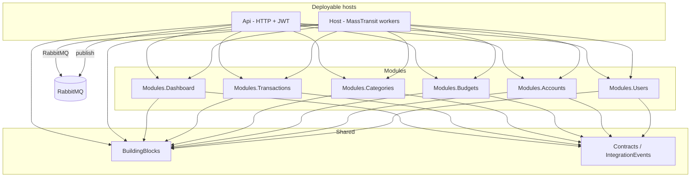

# FinTrack Modular Monolith + VSA Conventions

Architecture and coding conventions for evolving FinTrack into a modular monolith with Vertical Slice Architecture, first-class modules ordered by product prominence (Dashboard → Transactions → Categories → Budgets → Accounts → Users), auth, Mongo.Entities persistence, xUnit tests, and a MassTransit + RabbitMQ Host.

## Goal

Define the target architecture so FinTrack can grow into a large modular monolith without premature microservices.

First-class modules (**product prominence order**): **Dashboard** → **Transactions** → **Categories** → **Budgets** → **Accounts** → **Users** (owns auth; catalog last).

> **Auth gate:** The system is fully auth-protected. No feature is usable without registering and logging in. Catalog order is product prominence only — it does not mean Users is optional. Anonymous access is limited to auth entrypoints (`Register`, `Login`, `RefreshToken`).

## Target solution shape



| Project | Responsibility |
|---------|----------------|
| `Api` | HTTP endpoints, JWT auth middleware, Swagger, CORS. No business logic. |
| `Host` | MassTransit consumers, scheduled jobs, background processing. |
| `Modules.Dashboard` | Aggregated read models and summary APIs for the home/overview UI. **Top product priority.** |
| `Modules.Transactions` | Money movements (income/expense), linked to account/category via IDs. |
| `Modules.Categories` | Income/expense categories (user-defined + defaults). |
| `Modules.Budgets` | Budget limits per category/period; reacts to transaction events. |
| `Modules.Accounts` | Bank/cash/wallet accounts, balances projections. |
| `Modules.Users` | Identity, credentials, register/login/refresh, user profile. **Owns auth** (catalog last). |
| `BuildingBlocks` | Cross-cutting primitives (result types, paging, `ICurrentUser`, Mongo bootstrap, MediatR behaviors, auth token helpers shared at edge). |
| `Contracts` | Integration event DTOs shared across modules/hosts (no domain entities). |
| `*.Tests` | xUnit unit tests per module (handlers, validators, domain rules). |

**Deployables:** one `Api` process + one `Host` process. Modules stay in-process class libraries until a module truly needs extraction.

## Module catalog and boundaries

| Module | Owns (data) | Typical slices | Publishes (examples) | Consumes (examples) |
|--------|-------------|----------------|----------------------|---------------------|
| **Dashboard** | User dashboard snapshots / read models (denormalized) | GetDashboardSummary, GetSpendingByCategory, GetCashflowTrend | — (read-only API) | `TransactionCreated/Updated`, `AccountCreated/Closed`, `BudgetExceeded`, `UserRegistered` |
| **Transactions** | Transactions | CreateTransaction, ListTransactions, GetTransaction, Update/Delete | `TransactionCreated`, `TransactionUpdated` | — |
| **Categories** | Categories | CreateCategory, ListCategories, UpdateCategory | `CategoryCreated` | `UserRegistered` (seed defaults) |
| **Budgets** | Budgets, period spend projections | CreateBudget, ListBudgets, GetBudgetStatus | `BudgetExceeded` | `TransactionCreated`, `TransactionUpdated` |
| **Accounts** | Accounts | CreateAccount, ListAccounts, UpdateAccount, CloseAccount | `AccountCreated`, `AccountClosed` | `UserRegistered` (optional seed default account) |
| **Users** | Users, credentials, refresh tokens | Register, Login, RefreshToken, GetMe, UpdateProfile | `UserRegistered` | — |

**Cross-module references:** store foreign keys as string IDs only (`UserId`, `AccountId`, `CategoryId`). Never reference another module’s entity type. Prefer integration events for side effects (e.g. Budgets updating spend when a transaction is created; Dashboard updating snapshots).

**Suggested ownership rules**

- A Transaction belongs to one Account and one Category; both IDs must exist — validate via query contracts or eventual consistency (start with “caller supplies valid IDs”; harden with existence checks later).
- Budgets never write Transactions; they only react to events.
- Users never own financial entities; other modules key off `UserId` from `ICurrentUser`.
- **Dashboard is a read-side module:** it does not own write flows for money. It maintains its own Mongo collections (projections) updated by Host consumers. Dashboard **must not** query other modules’ collections or reference their entities — only consume `Contracts` events and serve fast summary queries to the UI.
- Dashboard payloads (convention): net worth / total balance, income vs expense for period, spend-by-category, recent activity counts, budget utilization — exact fields evolve with the React client, but the module boundary stays fixed.

## Auth conventions

Auth is a **hard system gate**, owned by **`Modules.Users`**, enforced at the **Api** edge. Without a successful **Register → Login** flow, a client cannot access Dashboard, Transactions, Categories, Budgets, Accounts, or any other business API.

**Approach (convention)**

- **JWT bearer** authentication (ASP.NET Core JWT middleware in Api).
- Users module handles register/login/refresh and issues tokens (access + refresh).
- Password hashing via ASP.NET Core Identity password hasher or a dedicated library (e.g. BCrypt) — keep hashing inside Users only.
- Refresh tokens stored in Mongo (Users module collections); rotate on use.
- **Default deny:** Api uses a global authorization fallback policy (`RequireAuthenticatedUser`) so every endpoint is protected unless explicitly marked anonymous.
- **Only anonymous endpoints:** `Register`, `Login`, `RefreshToken` (plus health/Swagger in Development). No guest browsing, no public dashboard, no unauthenticated reads.
- Frontend (React) must not enter the app shell until tokens exist; unauthenticated users only see auth screens.

**Api composition**

1. `AddAuthentication().AddJwtBearer(...)` configured from `Jwt` settings.
2. `AddAuthorization()` with fallback policy requiring authenticated user; optional named policies later (e.g. `Admin`).
3. Middleware order: exception handling → HTTPS → CORS → Authentication → Authorization → endpoints.
4. Unauthorized / challenge responses: consistent `401` (not authenticated) and `403` (authenticated but forbidden).

**Module access to identity**

- BuildingBlocks defines `ICurrentUser` (`UserId`, `Email`, `IsAuthenticated`). Handlers treat missing/unauthenticated user as a failure — never as “anonymous access.”
- Api registers an implementation that reads `HttpContext.User` claims.
- Handlers depend on `ICurrentUser` — never on `HttpContext` directly.
- Host consumers do not use interactive JWT; they trust message payloads / system identity. If a consumer needs a user, the event carries `UserId`.

**JWT config shape (convention)**

```json
"Jwt": {
  "Issuer": "FinTrack",
  "Audience": "FinTrack",
  "SigningKey": "<secrets-store-or-user-secrets>",
  "AccessTokenMinutes": 15,
  "RefreshTokenDays": 7
}
```

**Security conventions**

- Signing key only in user-secrets / env / vault — never committed.
- Every business module endpoint requires an authenticated user and filters data by `UserId` — no cross-user data leakage.
- Auth-related unit tests cover password hash verification, token claims shape, refresh rotation, and that non-auth endpoints reject unauthenticated calls (Users.Tests + Api policy tests later).

## Modular monolith rules

1. **Module = bounded context**, not a technical layer. Prominence order: **Dashboard → Transactions → Categories → Budgets → Accounts → Users**.
2. **No direct project references between modules.** Cross-module communication only via:
   - Integration events (MassTransit / RabbitMQ), or
   - Explicit public contracts in `Contracts` (read models / queries only when sync is required — prefer events).
3. **Each module owns its Mongo collections** and entity types. No shared entity classes across modules.
4. **Module public surface** is a DI extension only, e.g. `AddDashboardModule(...)`, `MapDashboardEndpoints(...)`. Same pattern for Transactions, Categories, Budgets, Accounts, Users.
5. **Internals stay internal** — use `internal` for handlers/entities where practical; expose only what Host/Api need.

## Vertical Slice Architecture (VSA) inside a module

Replace the current horizontal layers (`Application`, `Domain`, `Infrastructure`) with **feature folders** per module:

```text
Modules.Transactions/
  DependencyInjection.cs
  Features/
    CreateTransaction/
      CreateTransactionEndpoint.cs
      CreateTransactionCommand.cs
      CreateTransactionHandler.cs
      CreateTransactionValidator.cs
    GetTransactions/
      ...
  Domain/
    Transaction.cs
    TransactionType.cs
  Persistence/
    TransactionMap.cs
  EventHandlers/
    ...
```

Same layout for `Modules.Dashboard`, `Modules.Transactions`, `Modules.Categories`, `Modules.Budgets`, `Modules.Accounts`, `Modules.Users` (Dashboard emphasizes `EventHandlers/` + query slices over write commands).

**Slice conventions**

- One feature = one folder = one use case.
- Prefer **Minimal APIs or thin controllers** that only send a MediatR request.
- Handler owns orchestration; persistence via Mongo.Entities; no generic “god” Application service layer.
- Validation with **FluentValidation** consistently across modules.
- Keep feature code cohesive; extract shared helpers only after duplication appears twice.

## Persistence: Mongo.Entities + MongoDB.Driver

| Use | Tool |
|-----|------|
| CRUD, saves, simple finds, relationships | **Mongo.Entities** |
| Aggregations, complex filters, bulk ops, indexes not covered by Entities | **MongoDB.Driver** directly |

**Conventions**

- Entities inherit `Mongo.Entities.Entity` (or a BuildingBlocks `AuditableEntity` wrapping it) — migrate audit fields from the current `EntityBase` (`CreatedBy`, dates, timezone offset).
- Database name: `FinTrackDb`. Collection naming: plural, explicit via Mongo.Entities attributes/maps — do not rely on silent string concatenation.
- Initialize Mongo once per process (`DB.InitAsync`) in Api and Host via BuildingBlocks helper.
- Prefer module-specific persistence helpers over a shared generic `IRepository<T>` unless the generic stays thin.
- Connection string from configuration (`MongoDb:ConnectionString`); never hardcode.
- Multi-tenant by user: every financial document stores `UserId`; queries always scope by current user.

## Messaging: MassTransit + RabbitMQ + Host

**Api**

- May **publish** integration events after successful writes.
- Does not host long-running consumers.

**Host**

- Registers MassTransit with RabbitMQ transport.
- Registers all module consumers via each module’s `Add*Module` / `Add*Consumers`.
- Owns retry, poison-message, and observability configuration for consumers.

**Event conventions**

- Events live in `Contracts` as immutable records: past-tense names (`UserRegistered`, `TransactionCreated`, `BudgetExceeded`), versionable payloads, no Mongo entity types.
- Publishing happens at the end of a successful handler (outbox later when reliability requires it).
- Consumers are idempotent.
- Start **without** outbox; add outbox when Budgets/Accounts/Dashboard projections must not miss events. Dashboard freshness depends on reliable event delivery — treat missed events as a projection rebuild problem (replay / rebuild job later).

**RabbitMQ config shape (convention)**

```json
"RabbitMq": {
  "Host": "localhost",
  "Username": "guest",
  "Password": "guest"
}
```

## Testing (xUnit)

- One test project per module: `Modules.Dashboard.Tests`, `Modules.Transactions.Tests`, `Modules.Categories.Tests`, `Modules.Budgets.Tests`, `Modules.Accounts.Tests`, `Modules.Users.Tests`.
- Stack: **xUnit + FluentAssertions + NSubstitute**.
- **Unit tests first:** Dashboard projection reducers, handlers, validators, domain invariants, auth token/password rules — no Mongo/RabbitMQ required.
- Mirror feature folders in tests.
- Integration tests (WebApplicationFactory, Testcontainers) later.
- Naming: `Handle_WhenAmountInvalid_ReturnsValidationError`.

## Mapping from current codebase

| Current | Target |
|---------|--------|
| `TransactionsController` + MediatR command/handler | `Modules.Transactions/Features/CreateTransaction/*` |
| `Transaction` / `EntityBase` | Module domain + Mongo.Entities / AuditableEntity |
| Generic `Repository` | Mongo.Entities APIs (+ Driver when needed) |
| Commented MediatR / missing Mongo DI | Fixed in BuildingBlocks + module DI |
| Auth commented in `Program.cs` | JWT pipeline + `Modules.Users` |
| Single Api host | Api + Host |
| Only Transactions feature | Six module projects in prominence order (Dashboard → Transactions → Categories → Budgets → Accounts → Users) |

Prefer rename to `FinTrack.Api`, `FinTrack.Host`, `FinTrack.Modules.*`, `FinTrack.BuildingBlocks`, `FinTrack.Contracts` at first restructure.

## Coding / PR conventions

1. New features = new vertical slice folders; do not grow a shared Application layer.
2. New bounded contexts = new `Modules.*` project + DI entrypoint + tests project.
3. Cross-module needs = event in `Contracts` first; sync coupling needs review.
4. No business logic in Api/Host `Program.cs` beyond composition root.
5. Auth is a **hard gate** at the Api edge (global fallback authorize); modules use `ICurrentUser` from BuildingBlocks — no anonymous business access.
6. All financial data scoped by `UserId`.
7. Fix MediatR registration and Mongo DI as part of the first implementation restructure.

## Follow-ups (not required for conventions)

- Outbox pattern when Dashboard/Budgets/Accounts projections must not miss events.
- CI pipeline and `docker-compose` with Mongo + RabbitMQ.

## Recommended implementation order

Catalog prominence stays **Dashboard → … → Users**, but **Register/Login must ship first** — nothing else is reachable without them.

1. Create solution skeleton: BuildingBlocks, Contracts, modules in catalog order **Dashboard → Transactions → Categories → Budgets → Accounts → Users**, Api, Host, test projects.
2. Wire Mongo.Entities + MassTransit/RabbitMQ + **JWT with global `RequireAuthenticatedUser` fallback**.
3. Implement **Users auth entrypoints first** (`Register`, `Login`, `RefreshToken` + `ICurrentUser`) — the only anonymous APIs in the system.
4. Implement **Transactions** + **Categories** (all endpoints authorized; scoped by `UserId`).
5. Implement **Dashboard** projections + summary APIs (authorized; top product surface after login).
6. Add **Budgets** (authorized; reacts to `TransactionCreated`).
7. Add **Accounts** (authorized; balances / linkage).
8. Complete remaining **Users** surface (GetMe, UpdateProfile, hardening) — catalog last for product features, but auth already live from step 3.
9. Add xUnit tests; include auth-gate coverage (unauthenticated calls to business endpoints return 401).
10. Add docker-compose for local Mongo + RabbitMQ.
