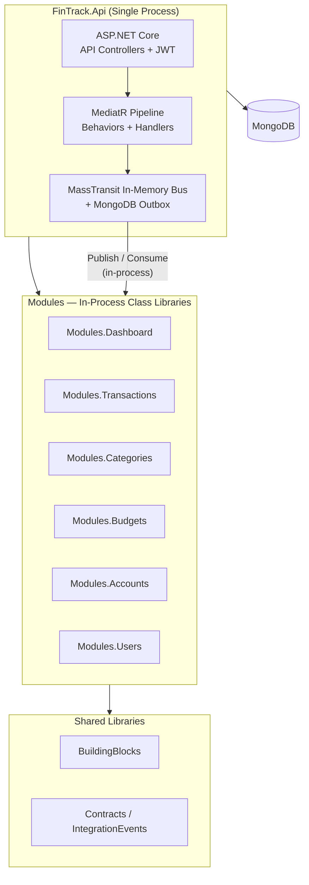

# FinTrack Architecture — Phase 1: Initial Single-Process Modular Monolith

Phase 1 architecture conventions for FinTrack as a **single-process modular monolith** with Vertical Slice Architecture, **API Controllers**, in-process messaging with **MongoDB Outbox**, direct Mongo aggregation read models, and strict module boundary enforcement.

This document evolves and supersedes the deployment topology and messaging strategy defined in the original [architecture-modular-monolith-vsa.md](./architecture-modular-monolith-vsa.md), which remains the foundational vision document.

---

## Goal

Ship the FinTrack MVP as a **single deployable process** (`FinTrack.Api`) with all six modules running in-process. Maintain strict bounded-context isolation so the codebase is ready for Phase 2 process separation without architectural rewrites.

First-class modules (**product prominence order**): **Dashboard** → **Transactions** → **Categories** → **Budgets** → **Accounts** → **Users** (owns auth; catalog last).

> **Auth gate:** The system is fully auth-protected. No feature is usable without registering and logging in. Anonymous access is limited to auth entrypoints (`Register`, `Login`, `RefreshToken`).

---

## Phase 1 deployment topology



**Key difference from the base plan:** No separate `Host` process. MassTransit consumers run in-process inside `FinTrack.Api` using the in-memory transport with MongoDB Outbox. This eliminates RabbitMQ as a Day-1 infrastructure dependency and reduces local development friction to a single `docker compose up`.

---

## Target solution shape

| Project | Responsibility |
|---------|----------------|
| `FinTrack.Api` | HTTP endpoints via **API Controllers**, JWT auth middleware, Swagger, CORS, MassTransit in-memory bus host, composition root. No business logic. |
| `Modules.Dashboard` | Aggregated read models via **direct Mongo aggregation pipelines**. No denormalized projections in Phase 1. **Top product priority.** |
| `Modules.Transactions` | Money movements (income/expense), linked to account/category via IDs. |
| `Modules.Categories` | Income/expense categories (user-defined + defaults). |
| `Modules.Budgets` | Budget limits per category/period; reacts to transaction events in-process. |
| `Modules.Accounts` | Bank/cash/wallet accounts, balance projections. |
| `Modules.Users` | Identity, credentials, register/login/refresh, user profile. **Owns auth.** |
| `BuildingBlocks` | Cross-cutting primitives: result types, paging, `ICurrentUser`, Mongo bootstrap, MediatR behaviors, auth token helpers, MongoDB Outbox configuration. |
| `Contracts` | Integration event DTOs + **synchronous query contract interfaces** shared across modules (no domain entities). |
| `*.Tests` | xUnit unit tests per module (handlers, validators, domain rules). |

**Deployable:** One `FinTrack.Api` process. Modules stay as in-process class libraries.

---

## Module catalog and boundaries

| Module | Owns (data) | Typical slices | Publishes (examples) | Consumes (examples) |
|--------|-------------|----------------|----------------------|---------------------|
| **Dashboard** | _None in Phase 1_ (reads via aggregation) | GetDashboardSummary, GetSpendingByCategory, GetCashflowTrend | — (read-only API) | _None in Phase 1_ (direct aggregation queries) |
| **Transactions** | Transactions collection | CreateTransaction, ListTransactions, GetTransaction, UpdateTransaction, DeleteTransaction | `TransactionCreated`, `TransactionUpdated` | — |
| **Categories** | Categories collection | CreateCategory, ListCategories, UpdateCategory | `CategoryCreated` | `UserRegistered` (seed defaults) |
| **Budgets** | Budgets collection, period spend snapshots | CreateBudget, ListBudgets, GetBudgetStatus | `BudgetExceeded` | `TransactionCreated`, `TransactionUpdated` |
| **Accounts** | Accounts collection | CreateAccount, ListAccounts, UpdateAccount, CloseAccount | `AccountCreated`, `AccountClosed` | `UserRegistered` (optional seed default account) |
| **Users** | Users, credentials, refresh tokens | Register, Login, RefreshToken, GetMe, UpdateProfile | `UserRegistered` | — |

**Cross-module references:** Store foreign keys as string IDs only (`UserId`, `AccountId`, `CategoryId`). Never reference another module's entity type.

---

## Cross-module communication strategy (Phase 1)

### Integration events (asynchronous, in-process)

Events live in `Contracts` as immutable records with past-tense names (`UserRegistered`, `TransactionCreated`). Publishing happens at the end of a successful handler via MassTransit's **in-memory transport**. Consumers are co-located in the same process and execute after the publishing handler completes.

### Synchronous query contracts (in-process validation)

For cross-module validation (e.g., `CreateTransaction` verifying that an `AccountId` exists), define lightweight query contracts in `Contracts`:

```csharp
// In FinTrack.Contracts/Queries/
public record ValidateAccountExistsQuery(string AccountId, string UserId) : IRequest<bool>;
public record ValidateCategoryExistsQuery(string CategoryId, string UserId) : IRequest<bool>;
```

The owning module registers the handler. The consuming module dispatches via MediatR without referencing the owning module's project. This keeps project references unidirectional while enabling synchronous validation.

```csharp
// In Modules.Accounts — handles the query
internal sealed class ValidateAccountExistsHandler : IRequestHandler<ValidateAccountExistsQuery, bool>
{
    public async Task<bool> Handle(ValidateAccountExistsQuery request, CancellationToken ct)
    {
        return await DB.Find<Account>()
            .Match(a => a.ID == request.AccountId && a.UserId == request.UserId)
            .ExecuteAnyAsync(ct);
    }
}

// In Modules.Transactions — consumes the query during CreateTransaction
internal sealed class CreateTransactionHandler : IRequestHandler<CreateTransactionCommand, Result<string>>
{
    private readonly ISender _sender;

    public CreateTransactionHandler(ISender sender) => _sender = sender;

    public async Task<Result<string>> Handle(CreateTransactionCommand cmd, CancellationToken ct)
    {
        var accountExists = await _sender.Send(new ValidateAccountExistsQuery(cmd.AccountId, cmd.UserId), ct);
        if (!accountExists)
            return Result<string>.Failure("Account not found.");

        // ... proceed with transaction creation
    }
}
```

---

## API presentation layer: Controllers

All HTTP endpoints use thin **ASP.NET Core API Controllers** inheriting `ControllerBase`. Controllers contain zero business logic — they delegate entirely to MediatR.

### Controller conventions

- One controller per feature slice (or per logical resource group within a module).
- Controllers live inside the module's `Features/` folder alongside the handler, command/query, and validator.
- Route prefix: `api/{module}/{resource}` (e.g., `api/transactions`, `api/users/auth`).
- Return `IActionResult` or `ActionResult<T>` with appropriate status codes.
- Use `[ApiController]` attribute for automatic model validation and `400` responses.

### Example vertical slice structure

```text
Modules.Transactions/
  DependencyInjection.cs
  Features/
    CreateTransaction/
      CreateTransactionController.cs    ← API Controller
      CreateTransactionCommand.cs       ← MediatR IRequest
      CreateTransactionHandler.cs       ← MediatR IRequestHandler
      CreateTransactionValidator.cs     ← FluentValidation
    GetTransactions/
      GetTransactionsController.cs
      GetTransactionsQuery.cs
      GetTransactionsHandler.cs
    GetTransaction/
      ...
    UpdateTransaction/
      ...
    DeleteTransaction/
      ...
  Domain/
    Transaction.cs
    TransactionType.cs
  Persistence/
    TransactionMap.cs
  EventHandlers/
    ...
```

### Example controller

```csharp
namespace FinTrack.Modules.Transactions.Features.CreateTransaction;

[ApiController]
[Route("api/transactions")]
public sealed class CreateTransactionController : ControllerBase
{
    private readonly ISender _sender;

    public CreateTransactionController(ISender sender) => _sender = sender;

    [HttpPost]
    [ProducesResponseType(typeof(string), StatusCodes.Status201Created)]
    [ProducesResponseType(StatusCodes.Status400BadRequest)]
    public async Task<IActionResult> Create(
        [FromBody] CreateTransactionCommand command,
        CancellationToken ct)
    {
        var result = await _sender.Send(command, ct);

        return result.IsSuccess
            ? CreatedAtAction(nameof(Create), new { id = result.Value }, result.Value)
            : BadRequest(result.Error);
    }
}
```

### Controller auto-discovery

Modules are class libraries, so their controllers are not automatically discovered by the `FinTrack.Api` host. Register them explicitly in each module's DI extension:

```csharp
// In Modules.Transactions/DependencyInjection.cs
public static class DependencyInjection
{
    public static IServiceCollection AddTransactionsModule(this IServiceCollection services)
    {
        // MediatR handlers
        services.AddMediatR(cfg => cfg.RegisterServicesFromAssembly(typeof(DependencyInjection).Assembly));

        // FluentValidation validators
        services.AddValidatorsFromAssembly(typeof(DependencyInjection).Assembly);

        return services;
    }
}

// In FinTrack.Api/Program.cs (composition root)
builder.Services
    .AddControllers()
    .AddApplicationPart(typeof(Modules.Transactions.DependencyInjection).Assembly)
    .AddApplicationPart(typeof(Modules.Users.DependencyInjection).Assembly)
    .AddApplicationPart(typeof(Modules.Categories.DependencyInjection).Assembly)
    .AddApplicationPart(typeof(Modules.Budgets.DependencyInjection).Assembly)
    .AddApplicationPart(typeof(Modules.Accounts.DependencyInjection).Assembly)
    .AddApplicationPart(typeof(Modules.Dashboard.DependencyInjection).Assembly);
```

---

## Auth conventions

Auth is a **hard system gate**, owned by **`Modules.Users`**, enforced at the **Api** edge.

### Approach

- **JWT bearer** authentication (ASP.NET Core JWT middleware in Api).
- Users module handles register/login/refresh and issues tokens (access + refresh).
- Password hashing via ASP.NET Core Identity password hasher or BCrypt — kept inside Users only.
- Refresh tokens stored in Mongo (Users module collections); rotate on use.
- **Default deny:** Api uses a global authorization fallback policy (`RequireAuthenticatedUser`) so every endpoint is protected unless explicitly marked `[AllowAnonymous]`.
- **Only anonymous endpoints:** `Register`, `Login`, `RefreshToken` (plus health check and Swagger in Development).

### Module access to identity

- `BuildingBlocks` defines `ICurrentUser` (`UserId`, `Email`, `IsAuthenticated`).
- Api registers an implementation that reads `HttpContext.User` claims.
- Handlers depend on `ICurrentUser` — never on `HttpContext` directly.
- Every business query scopes data by `ICurrentUser.UserId`.

### JWT config shape

```json
{
  "Jwt": {
    "Issuer": "FinTrack",
    "Audience": "FinTrack",
    "SigningKey": "<secrets-store-or-user-secrets>",
    "AccessTokenMinutes": 15,
    "RefreshTokenDays": 7
  }
}
```

### Security conventions

- Signing key only in user-secrets / env / vault — never committed.
- Every business module endpoint requires an authenticated user and filters data by `UserId` — no cross-user data leakage.
- Auth-related unit tests cover password hash verification, token claims shape, refresh rotation, and that non-auth endpoints reject unauthenticated calls.

---

## Modular monolith rules

1. **Module = bounded context**, not a technical layer.
2. **No direct project references between modules.** Cross-module communication only via:
   - Integration events (MassTransit in-memory bus), or
   - Synchronous query contracts in `Contracts` dispatched via MediatR.
3. **Each module owns its Mongo collections** and entity types. No shared entity classes across modules.
4. **Module public surface** is a DI extension only: `AddTransactionsModule(...)`. Same pattern for all modules.
5. **Internals stay internal** — use `internal` for handlers/entities where practical; expose only what Api needs.

---

## Persistence: Mongo.Entities + MongoDB.Driver

| Use | Tool |
|-----|------|
| CRUD, saves, simple finds, relationships | **Mongo.Entities** |
| Aggregations, complex filters, bulk ops | **MongoDB.Driver** directly |

### Conventions

- Entities inherit `Mongo.Entities.Entity` (or a BuildingBlocks `AuditableEntity` wrapping it) with audit fields (`CreatedBy`, `CreatedAt`, `ModifiedAt`).
- Database name: `FinTrackDb`. Collection naming: plural, explicit via Mongo.Entities attributes/maps.
- Initialize Mongo once in `FinTrack.Api` via BuildingBlocks helper (`DB.InitAsync`).
- Connection string from configuration (`MongoDb:ConnectionString`); never hardcode.
- Multi-tenant by user: every financial document stores `UserId`; queries always scope by current user.

### Mandatory indexing conventions

Every collection must define compound indexes that include `UserId` as the leading key:

```csharp
// In Modules.Transactions/Persistence/TransactionMap.cs
public class TransactionMap : IEntityMap
{
    public void Map()
    {
        DB.Index<Transaction>()
            .Key(t => t.UserId, KeyType.Ascending)
            .Key(t => t.Date, KeyType.Descending)
            .CreateAsync();

        DB.Index<Transaction>()
            .Key(t => t.UserId, KeyType.Ascending)
            .Key(t => t.CategoryId, KeyType.Ascending)
            .CreateAsync();
    }
}
```

---

## Messaging: MassTransit In-Memory + MongoDB Outbox

### Why MongoDB Outbox on Day 1

Without an outbox, publishing an event after a successful Mongo write creates a **dual-write failure window**: if the in-memory bus dispatch fails (e.g., unhandled consumer exception before acknowledgement), the event is lost. MassTransit's MongoDB Outbox writes the event atomically alongside the business entity in the same Mongo transaction, then dispatches it reliably.

### Configuration

```csharp
// In FinTrack.Api/Program.cs
builder.Services.AddMassTransit(cfg =>
{
    // Discover consumers from all module assemblies
    cfg.AddConsumers(
        typeof(Modules.Categories.DependencyInjection).Assembly,
        typeof(Modules.Budgets.DependencyInjection).Assembly,
        typeof(Modules.Accounts.DependencyInjection).Assembly
    );

    cfg.UsingInMemory((context, busConfig) =>
    {
        busConfig.ConfigureEndpoints(context);
    });

    // MongoDB Outbox for atomic event publishing
    cfg.AddMongoDbOutbox(outbox =>
    {
        outbox.ClientFactory(provider => provider.GetRequiredService<IMongoClient>());
        outbox.DatabaseFactory(provider => provider.GetRequiredService<IMongoDatabase>());

        outbox.DuplicateDetectionWindow = TimeSpan.FromSeconds(30);
        outbox.UseBusOutbox();
    });
});
```

### Event conventions

- Events live in `Contracts` as immutable records: past-tense names (`UserRegistered`, `TransactionCreated`), no Mongo entity types.
- Publishing happens at the end of a successful handler.
- Consumers are idempotent.

---

## Dashboard strategy (Phase 1): Direct Mongo aggregation

In Phase 1, `Modules.Dashboard` does **not** maintain denormalized projection collections. Instead, it executes **MongoDB aggregation pipelines** directly against the source collections (Transactions, Accounts, Budgets) scoped by `UserId`.

### Rationale

For a single-user personal finance app with moderate data volumes, direct aggregation is simpler, delivers real-time accuracy with zero eventual-consistency lag, and eliminates the entire event-driven projection rebuild problem.

### Example: Spending by category

```csharp
internal sealed class GetSpendingByCategoryHandler
    : IRequestHandler<GetSpendingByCategoryQuery, Result<List<SpendingByCategoryDto>>>
{
    private readonly IMongoCollection<Transaction> _transactions;
    private readonly ICurrentUser _currentUser;

    public async Task<Result<List<SpendingByCategoryDto>>> Handle(
        GetSpendingByCategoryQuery query, CancellationToken ct)
    {
        var pipeline = _transactions.Aggregate()
            .Match(t => t.UserId == _currentUser.UserId
                      && t.Type == TransactionType.Expense
                      && t.Date >= query.From && t.Date <= query.To)
            .Group(t => t.CategoryId, g => new SpendingByCategoryDto
            {
                CategoryId = g.Key,
                TotalAmount = g.Sum(t => t.Amount),
                TransactionCount = g.Count()
            })
            .SortByDescending(s => s.TotalAmount);

        var results = await pipeline.ToListAsync(ct);
        return Result<List<SpendingByCategoryDto>>.Success(results);
    }
}
```

> **Phase 2 migration note:** When data volume or query latency warrants it, these aggregation handlers are replaced with reads against denormalized projection collections maintained by MassTransit consumers in the `Host` worker. The controller and query contract remain unchanged — only the handler implementation swaps.

---

## Testing (xUnit)

- One test project per module: `Modules.Dashboard.Tests`, `Modules.Transactions.Tests`, `Modules.Categories.Tests`, `Modules.Budgets.Tests`, `Modules.Accounts.Tests`, `Modules.Users.Tests`.
- Stack: **xUnit + FluentAssertions + NSubstitute**.
- **Unit tests first:** handlers, validators, domain invariants, auth token/password rules — no Mongo or message bus required.
- Mirror feature folders in tests.
- Integration tests (WebApplicationFactory, Testcontainers) deferred to late Phase 1 or Phase 2.
- Naming: `Handle_WhenAmountInvalid_ReturnsValidationError`.

---

## Mapping from current codebase

| Current | Phase 1 Target |
|---------|----------------|
| `TransactionsController` + MediatR command/handler | `Modules.Transactions/Features/CreateTransaction/CreateTransactionController.cs` + handler |
| `Transaction` / `EntityBase` | Module domain + Mongo.Entities `AuditableEntity` |
| Generic `Repository` | Mongo.Entities APIs (+ Driver when needed) |
| Commented MediatR / missing Mongo DI | Fixed in BuildingBlocks + module DI |
| Auth commented in `Program.cs` | JWT pipeline + `Modules.Users` |
| Single Api host | Single `FinTrack.Api` with in-memory MassTransit bus |
| Only Transactions feature | Six module projects in prominence order |

---

## Coding / PR conventions

1. New features = new vertical slice folders; do not grow a shared Application layer.
2. New bounded contexts = new `Modules.*` project + DI entrypoint + tests project.
3. Cross-module needs = event in `Contracts` first; synchronous query contract if validation requires it.
4. No business logic in Api `Program.cs` beyond composition root.
5. Auth is a **hard gate** at the Api edge (global fallback authorize); modules use `ICurrentUser` from BuildingBlocks.
6. All financial data scoped by `UserId`.
7. Every collection must have a compound index with `UserId` as leading key.

---

## Recommended implementation order

Catalog prominence stays **Dashboard → … → Users**, but **Register/Login must ship first**.

1. Create solution skeleton: `BuildingBlocks`, `Contracts`, module projects (Dashboard, Transactions, Categories, Budgets, Accounts, Users), `FinTrack.Api`, test projects.
2. Wire Mongo.Entities + MassTransit in-memory bus with MongoDB Outbox + JWT with global `RequireAuthenticatedUser` fallback.
3. Implement **Users auth entrypoints** (`Register`, `Login`, `RefreshToken` + `ICurrentUser`) — the only `[AllowAnonymous]` APIs.
4. Implement **Transactions** + **Categories** (all endpoints authorized; scoped by `UserId`; cross-module validation via synchronous query contracts).
5. Implement **Dashboard** summary APIs using direct Mongo aggregation pipelines.
6. Add **Budgets** (reacts to `TransactionCreated` via in-process consumer).
7. Add **Accounts** (balances / linkage).
8. Complete remaining **Users** surface (GetMe, UpdateProfile).
9. Add xUnit tests; include auth-gate coverage (unauthenticated calls return 401).
10. Add `docker/phase1/docker-compose.yml` for local Mongo.

---

## Follow-ups (deferred to Phase 2)

- Separate `FinTrack.Host` worker process.
- RabbitMQ transport replacing in-memory bus.
- Denormalized event-driven Dashboard projections.
- MassTransit Saga State Machines for complex financial workflows.
- Observability (OpenTelemetry, Prometheus).
- CI pipeline with multi-container docker-compose.
