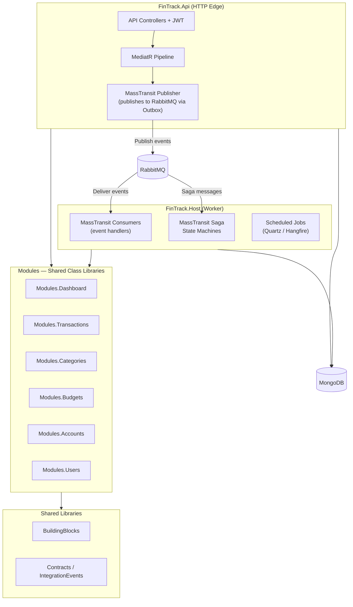
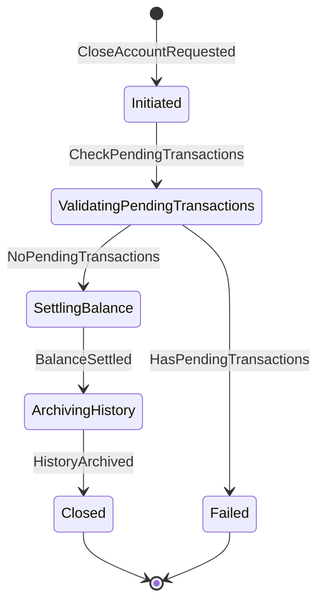

# FinTrack Architecture — Phase 2: Distributed Scale-Out (After-Load)

Phase 2 architecture conventions for evolving FinTrack from the single-process Phase 1 deployment into a **distributed modular monolith** with separated API and worker host processes, **RabbitMQ** message broker transport, event-driven denormalized read models, **MassTransit Saga State Machines**, and production observability.

This document builds on the foundation established in [architecture-phase1-initial.md](./architecture-phase1-initial.md). Phase 2 changes are additive — the module boundaries, API Controllers, `Contracts`, `BuildingBlocks`, auth conventions, VSA feature folder structure, and xUnit testing strategy remain identical.

---

## Goal

Scale FinTrack to handle high message throughput, complex multi-step financial workflows, and production-grade reliability by:

1. **Splitting the runtime** into `FinTrack.Api` (HTTP edge) and `FinTrack.Host` (background consumer/worker process).
2. **Introducing RabbitMQ** as an external message broker for durable, distributed event delivery.
3. **Replacing direct Mongo aggregation** with denormalized event-driven **Dashboard projections** for sub-millisecond read performance.
4. **Orchestrating complex workflows** (transfers, account closures) via **MassTransit Saga State Machines**.
5. **Adding observability** with OpenTelemetry, structured logging, and health checks.

---

## Phase 2 deployment topology



---

## What changes from Phase 1

| Concern | Phase 1 (Initial) | Phase 2 (Scale-Out) |
|---------|-------------------|---------------------|
| **Deployable processes** | Single `FinTrack.Api` | `FinTrack.Api` + `FinTrack.Host` |
| **Message transport** | MassTransit in-memory bus | MassTransit + **RabbitMQ** |
| **Event publishing** | In-process dispatch via MongoDB Outbox | MongoDB Outbox → RabbitMQ dispatch |
| **Dashboard reads** | Direct Mongo aggregation pipelines | **Denormalized projection collections** maintained by Host consumers |
| **Complex workflows** | Simple event → consumer | **MassTransit Saga State Machines** |
| **Observability** | Console/debug logging | OpenTelemetry traces + Prometheus metrics + structured logging |
| **Scheduled work** | None | Quartz-based scheduled consumers in Host |
| **Infrastructure** | MongoDB only | MongoDB + RabbitMQ + (optional) Prometheus/Grafana |

### What does NOT change

- Module boundaries and ownership (same 6 modules).
- API Controllers and route conventions (same controllers, same endpoints).
- `Contracts` and `BuildingBlocks` libraries.
- Auth conventions (JWT default-deny, `ICurrentUser`).
- VSA feature folder structure.
- xUnit test projects and conventions.
- `Mongo.Entities` persistence and indexing conventions.

---

## Process separation: Api vs Host

### `FinTrack.Api` responsibilities

- HTTP endpoints via API Controllers.
- JWT authentication/authorization middleware.
- Swagger / OpenAPI documentation.
- CORS configuration.
- **Publishes** integration events to RabbitMQ after successful command handlers (via MongoDB Outbox).
- Does **not** host long-running consumers or saga state machines.

### `FinTrack.Host` responsibilities

- MassTransit consumer host connected to RabbitMQ.
- Registers all module consumers and saga state machines.
- Owns retry policies, dead-letter/poison-message handling, and consumer observability.
- Runs scheduled jobs (e.g., recurring budget period rollover, stale projection rebuild).
- Does **not** serve HTTP traffic.

### Host project structure

```text
FinTrack.Host/
  Program.cs                     ← Composition root: MassTransit + RabbitMQ + module consumers
  appsettings.json               ← RabbitMQ + MongoDB config
  appsettings.Development.json
```

### Host composition root

```csharp
// FinTrack.Host/Program.cs
var builder = Host.CreateApplicationBuilder(args);

// MongoDB initialization (shared with Api via BuildingBlocks helper)
await builder.Services.AddMongoDbAsync(builder.Configuration);

// MassTransit with RabbitMQ transport
builder.Services.AddMassTransit(cfg =>
{
    // Auto-discover consumers from module assemblies
    cfg.AddConsumers(
        typeof(Modules.Dashboard.DependencyInjection).Assembly,
        typeof(Modules.Categories.DependencyInjection).Assembly,
        typeof(Modules.Budgets.DependencyInjection).Assembly,
        typeof(Modules.Accounts.DependencyInjection).Assembly
    );

    // Register saga state machines
    cfg.AddSagaStateMachine<AccountClosureSaga, AccountClosureState>()
        .MongoDbRepository(r =>
        {
            r.Connection = builder.Configuration["MongoDb:ConnectionString"];
            r.DatabaseName = "FinTrackDb";
            r.CollectionName = "saga_account_closure";
        });

    cfg.UsingRabbitMq((context, rabbitCfg) =>
    {
        rabbitCfg.Host(builder.Configuration["RabbitMq:Host"], h =>
        {
            h.Username(builder.Configuration["RabbitMq:Username"]!);
            h.Password(builder.Configuration["RabbitMq:Password"]!);
        });

        // Global retry policy
        rabbitCfg.UseMessageRetry(r => r.Intervals(
            TimeSpan.FromSeconds(1),
            TimeSpan.FromSeconds(5),
            TimeSpan.FromSeconds(15)
        ));

        rabbitCfg.ConfigureEndpoints(context);
    });

    // MongoDB Outbox (same pattern as Phase 1, now dispatches to RabbitMQ)
    cfg.AddMongoDbOutbox(outbox =>
    {
        outbox.ClientFactory(provider => provider.GetRequiredService<IMongoClient>());
        outbox.DatabaseFactory(provider => provider.GetRequiredService<IMongoDatabase>());
        outbox.DuplicateDetectionWindow = TimeSpan.FromSeconds(30);
        outbox.UseBusOutbox();
    });
});

var host = builder.Build();
await host.RunAsync();
```

---

## Messaging: MassTransit + RabbitMQ

### Migration from Phase 1 in-memory bus

The only code change required is swapping the MassTransit transport configuration:

```diff
 // FinTrack.Api/Program.cs — MassTransit registration
 builder.Services.AddMassTransit(cfg =>
 {
-    cfg.UsingInMemory((context, busConfig) =>
-    {
-        busConfig.ConfigureEndpoints(context);
-    });
+    cfg.UsingRabbitMq((context, rabbitCfg) =>
+    {
+        rabbitCfg.Host(builder.Configuration["RabbitMq:Host"], h =>
+        {
+            h.Username(builder.Configuration["RabbitMq:Username"]!);
+            h.Password(builder.Configuration["RabbitMq:Password"]!);
+        });
+        rabbitCfg.ConfigureEndpoints(context);
+    });
 });
```

All existing consumers, event contracts, and outbox configuration remain unchanged. This is the primary benefit of building on MassTransit's transport abstraction from Day 1.

### RabbitMQ config shape

```json
{
  "RabbitMq": {
    "Host": "localhost",
    "Username": "guest",
    "Password": "guest"
  }
}
```

### Event conventions (unchanged from Phase 1)

- Events live in `Contracts` as immutable records with past-tense names.
- Publishing happens at the end of a successful handler via MongoDB Outbox.
- Consumers are idempotent.
- Dead-letter queues capture poison messages after retry exhaustion.

### Consumer error handling

```csharp
// Applied globally in Host MassTransit configuration
rabbitCfg.UseMessageRetry(r => r.Intervals(
    TimeSpan.FromSeconds(1),
    TimeSpan.FromSeconds(5),
    TimeSpan.FromSeconds(15)
));

// Per-endpoint dead-letter configuration (automatic with MassTransit RabbitMQ)
// Failed messages after retries go to: {queue-name}_error
// Skipped messages go to: {queue-name}_skipped
```

---

## Dashboard strategy (Phase 2): Event-driven denormalized projections

### Migration from Phase 1

In Phase 1, `Modules.Dashboard` uses direct Mongo aggregation pipelines. In Phase 2, those handlers are replaced with reads against **denormalized projection collections** that are maintained by Host consumers reacting to domain events.

### Projection collections

| Collection | Maintained by events | Serves |
|------------|---------------------|--------|
| `dashboard_user_summary` | `TransactionCreated`, `TransactionUpdated`, `AccountCreated`, `AccountClosed` | `GetDashboardSummary` |
| `dashboard_spending_by_category` | `TransactionCreated`, `TransactionUpdated` | `GetSpendingByCategory` |
| `dashboard_cashflow_trend` | `TransactionCreated`, `TransactionUpdated` | `GetCashflowTrend` |

### Example: Projection consumer

```csharp
// In Modules.Dashboard/EventHandlers/UpdateSpendingByCategoryConsumer.cs
public sealed class UpdateSpendingByCategoryConsumer : IConsumer<TransactionCreated>
{
    public async Task Consume(ConsumeContext<TransactionCreated> context)
    {
        var evt = context.Message;

        if (evt.Type != TransactionType.Expense)
            return;

        // Upsert the spending projection atomically
        await DB.Update<SpendingByCategoryProjection>()
            .Match(p => p.UserId == evt.UserId
                      && p.CategoryId == evt.CategoryId
                      && p.PeriodKey == evt.Date.ToString("yyyy-MM"))
            .Modify(p => p.Inc(x => x.TotalAmount, evt.Amount))
            .Modify(p => p.Inc(x => x.TransactionCount, 1))
            .Modify(p => p.Set(x => x.UserId, evt.UserId))
            .Modify(p => p.Set(x => x.CategoryId, evt.CategoryId))
            .Option(o => o.IsUpsert = true)
            .ExecuteAsync();
    }
}
```

### Example: Projection read handler (replaces Phase 1 aggregation)

```csharp
// Replaces the Phase 1 GetSpendingByCategoryHandler
internal sealed class GetSpendingByCategoryHandler
    : IRequestHandler<GetSpendingByCategoryQuery, Result<List<SpendingByCategoryDto>>>
{
    private readonly ICurrentUser _currentUser;

    public async Task<Result<List<SpendingByCategoryDto>>> Handle(
        GetSpendingByCategoryQuery query, CancellationToken ct)
    {
        // Fast indexed read from denormalized projection — no aggregation needed
        var results = await DB.Find<SpendingByCategoryProjection>()
            .Match(p => p.UserId == _currentUser.UserId
                      && p.PeriodKey == query.Period.ToString("yyyy-MM"))
            .Sort(p => p.TotalAmount, Order.Descending)
            .ExecuteAsync(ct);

        return Result<List<SpendingByCategoryDto>>.Success(
            results.Select(p => new SpendingByCategoryDto
            {
                CategoryId = p.CategoryId,
                TotalAmount = p.TotalAmount,
                TransactionCount = p.TransactionCount
            }).ToList());
    }
}
```

### Projection rebuild

When projections drift or a new projection is added, run a one-time rebuild job:

```csharp
// Scheduled via Host — iterates source collections and replays into projections
public sealed class RebuildDashboardProjectionsJob : IConsumer<RebuildDashboardProjectionsCommand>
{
    public async Task Consume(ConsumeContext<RebuildDashboardProjectionsCommand> context)
    {
        // 1. Drop existing projection collections
        // 2. Iterate Transactions collection in batches
        // 3. Rebuild projections by simulating event handling
        // 4. Log completion metrics
    }
}
```

---

## Saga State Machines: Complex financial workflows

### When to use sagas

Use MassTransit Saga State Machines when a workflow spans multiple modules and requires **coordinated rollback** or **multi-step orchestration**:

| Workflow | Why Saga |
|----------|----------|
| **Account Closure** | Must verify no pending transactions, settle balances, archive history, then close |
| **Inter-Account Transfer** | Must debit source account and credit destination atomically |
| **Budget Period Rollover** | Must snapshot current period, reset counters, notify users |

### Example: Account Closure Saga



```csharp
// In Modules.Accounts/Sagas/AccountClosureSaga.cs
public sealed class AccountClosureSaga : MassTransitStateMachine<AccountClosureState>
{
    public State Initiated { get; private set; } = null!;
    public State ValidatingPendingTransactions { get; private set; } = null!;
    public State SettlingBalance { get; private set; } = null!;
    public State ArchivingHistory { get; private set; } = null!;
    public State Closed { get; private set; } = null!;
    public State Failed { get; private set; } = null!;

    public Event<CloseAccountRequested> CloseAccountRequested { get; private set; } = null!;
    public Event<PendingTransactionsChecked> PendingTransactionsChecked { get; private set; } = null!;
    public Event<BalanceSettled> BalanceSettled { get; private set; } = null!;
    public Event<HistoryArchived> HistoryArchived { get; private set; } = null!;

    public AccountClosureSaga()
    {
        InstanceState(x => x.CurrentState);

        Event(() => CloseAccountRequested, x => x.CorrelateById(ctx => ctx.Message.AccountId));
        Event(() => PendingTransactionsChecked, x => x.CorrelateById(ctx => ctx.Message.AccountId));
        Event(() => BalanceSettled, x => x.CorrelateById(ctx => ctx.Message.AccountId));
        Event(() => HistoryArchived, x => x.CorrelateById(ctx => ctx.Message.AccountId));

        Initially(
            When(CloseAccountRequested)
                .Then(ctx => ctx.Saga.AccountId = ctx.Message.AccountId)
                .TransitionTo(Initiated)
                .Publish(ctx => new CheckPendingTransactions(ctx.Saga.AccountId))
        );

        During(Initiated,
            When(PendingTransactionsChecked)
                .IfElse(
                    ctx => ctx.Message.HasPending,
                    binder => binder.TransitionTo(Failed),
                    binder => binder
                        .TransitionTo(ValidatingPendingTransactions)
                        .Publish(ctx => new SettleAccountBalance(ctx.Saga.AccountId))
                )
        );

        During(ValidatingPendingTransactions,
            When(BalanceSettled)
                .TransitionTo(SettlingBalance)
                .Publish(ctx => new ArchiveAccountHistory(ctx.Saga.AccountId))
        );

        During(SettlingBalance,
            When(HistoryArchived)
                .TransitionTo(Closed)
                .Publish(ctx => new AccountClosed(ctx.Saga.AccountId))
                .Finalize()
        );
    }
}

public class AccountClosureState : SagaStateMachineInstance, ISagaVersion
{
    public Guid CorrelationId { get; set; }
    public int Version { get; set; }
    public string CurrentState { get; set; } = string.Empty;
    public string AccountId { get; set; } = string.Empty;
}
```

### Saga persistence

Saga state is persisted in MongoDB via MassTransit's `MongoDbRepository`:

```csharp
cfg.AddSagaStateMachine<AccountClosureSaga, AccountClosureState>()
    .MongoDbRepository(r =>
    {
        r.Connection = configuration["MongoDb:ConnectionString"];
        r.DatabaseName = "FinTrackDb";
        r.CollectionName = "saga_account_closure";
    });
```

---

## Resiliency patterns

### Retry + Circuit Breaker (Polly)

Apply Polly policies to external calls (e.g., future payment gateway integrations, email services):

```csharp
// In BuildingBlocks/Resilience/ResiliencyPolicies.cs
public static class ResiliencyPolicies
{
    public static IAsyncPolicy<HttpResponseMessage> GetStandardPolicy()
    {
        var retryPolicy = Policy<HttpResponseMessage>
            .Handle<HttpRequestException>()
            .OrResult(r => r.StatusCode >= System.Net.HttpStatusCode.InternalServerError)
            .WaitAndRetryAsync(3, attempt => TimeSpan.FromSeconds(Math.Pow(2, attempt)));

        var circuitBreaker = Policy<HttpResponseMessage>
            .Handle<HttpRequestException>()
            .CircuitBreakerAsync(5, TimeSpan.FromSeconds(30));

        return Policy.WrapAsync(retryPolicy, circuitBreaker);
    }
}
```

### Rate limiting (ASP.NET Core)

```csharp
// In FinTrack.Api/Program.cs
builder.Services.AddRateLimiter(options =>
{
    options.AddFixedWindowLimiter("auth", limiter =>
    {
        limiter.PermitLimit = 5;
        limiter.Window = TimeSpan.FromMinutes(1);
        limiter.QueueLimit = 0;
    });

    options.AddFixedWindowLimiter("api", limiter =>
    {
        limiter.PermitLimit = 100;
        limiter.Window = TimeSpan.FromMinutes(1);
        limiter.QueueLimit = 10;
    });

    options.RejectionStatusCode = StatusCodes.Status429TooManyRequests;
});
```

Apply via controller attributes:

```csharp
[EnableRateLimiting("auth")]
public sealed class LoginController : ControllerBase { ... }
```

---

## Observability

### OpenTelemetry

```csharp
// In FinTrack.Api/Program.cs and FinTrack.Host/Program.cs
builder.Services.AddOpenTelemetry()
    .ConfigureResource(r => r.AddService("FinTrack.Api")) // or "FinTrack.Host"
    .WithTracing(tracing =>
    {
        tracing
            .AddAspNetCoreInstrumentation()
            .AddHttpClientInstrumentation()
            .AddSource("MassTransit")
            .AddOtlpExporter();
    })
    .WithMetrics(metrics =>
    {
        metrics
            .AddAspNetCoreInstrumentation()
            .AddHttpClientInstrumentation()
            .AddMeter("MassTransit")
            .AddPrometheusExporter();
    });
```

### Structured logging

Use Serilog with structured output targeting console + Seq/Elasticsearch:

```csharp
builder.Host.UseSerilog((context, logConfig) =>
{
    logConfig
        .ReadFrom.Configuration(context.Configuration)
        .Enrich.FromLogContext()
        .Enrich.WithProperty("Service", "FinTrack.Api")
        .WriteTo.Console(outputTemplate:
            "[{Timestamp:HH:mm:ss} {Level:u3}] {SourceContext} {Message:lj}{NewLine}{Exception}");
});
```

### Health checks

```csharp
// In FinTrack.Api/Program.cs
builder.Services.AddHealthChecks()
    .AddMongoDb(builder.Configuration["MongoDb:ConnectionString"]!, name: "mongodb")
    .AddRabbitMQ(builder.Configuration["RabbitMq:Host"]!, name: "rabbitmq");

// Expose at /healthz (exempt from auth via [AllowAnonymous] or mapped before auth middleware)
app.MapHealthChecks("/healthz");
```

---

## Zero-breaking-change migration roadmap: Phase 1 → Phase 2

This migration is designed to be **incremental** with no API contract changes and no module rewrites.

### Step 1: Add `FinTrack.Host` project

- Create `FinTrack.Host` as a new .NET Worker Service project.
- Reference the same module class libraries that `FinTrack.Api` references.
- Register MassTransit with RabbitMQ transport in Host's `Program.cs`.

### Step 2: Swap Api transport from in-memory to RabbitMQ

- Change `cfg.UsingInMemory(...)` to `cfg.UsingRabbitMq(...)` in `FinTrack.Api/Program.cs`.
- Remove consumer registrations from Api (consumers now run in Host).
- Api retains only the MassTransit publisher + MongoDB Outbox configuration.

### Step 3: Add RabbitMQ to infrastructure

- Add `rabbitmq:3-management` service to `docker-compose.yml`.
- Add `RabbitMq` configuration section to `appsettings.json` for both Api and Host.

### Step 4: Migrate Dashboard to denormalized projections

- Create projection entity classes in `Modules.Dashboard/Domain/`.
- Create MassTransit consumers in `Modules.Dashboard/EventHandlers/`.
- Replace aggregation handler implementations with simple indexed reads.
- Run a one-time projection rebuild job.

### Step 5: Add Saga State Machines

- Define saga state machines in the owning module's `Sagas/` folder.
- Register sagas in Host's MassTransit configuration with `MongoDbRepository`.
- Add saga event contracts to `Contracts`.

### Step 6: Add observability

- Add OpenTelemetry NuGet packages to Api and Host.
- Configure tracing, metrics, and structured logging.
- Add Prometheus/Grafana to `docker-compose.yml` (optional).

---

## Phase 2 docker-compose reference

See [docker/phase2/docker-compose.yml](../docker/phase2/docker-compose.yml) for the full multi-container local environment setup including `FinTrack.Api`, `FinTrack.Host`, MongoDB, and RabbitMQ with Management Dashboard.

---

## Testing additions (Phase 2)

### Integration tests

- **WebApplicationFactory** tests for Api endpoints with Testcontainers (Mongo + RabbitMQ).
- **MassTransit Test Harness** for consumer and saga unit tests.
- **Projection rebuild verification** tests.

### Saga tests

```csharp
[Fact]
public async Task AccountClosureSaga_WhenNoPendingTransactions_TransitionsToClosedState()
{
    var harness = new InMemoryTestHarness();
    var sagaHarness = harness.StateMachineSaga<AccountClosureState>(new AccountClosureSaga());

    await harness.Start();

    var accountId = ObjectId.GenerateNewId().ToString();

    await harness.Bus.Publish(new CloseAccountRequested(accountId));

    Assert.True(await sagaHarness.Consumed.Any<CloseAccountRequested>());

    // Simulate: no pending transactions
    await harness.Bus.Publish(new PendingTransactionsChecked(accountId, HasPending: false));
    await harness.Bus.Publish(new BalanceSettled(accountId));
    await harness.Bus.Publish(new HistoryArchived(accountId));

    var instance = sagaHarness.Sagas.ContainsInState(accountId, sagaHarness.StateMachine, sagaHarness.StateMachine.Closed);
    Assert.NotNull(instance);

    await harness.Stop();
}
```
