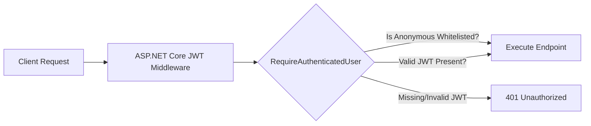

# FinTrack — System & Technical Specification

This document defines the formal system architecture, data models, security contracts, and implementation specifications for **FinTrack**, a modular monolith personal finance web application built on **.NET 10**.

---

## 1. Executive Summary & Vision

FinTrack provides individuals with personal finance tracking capabilities (income/expense management, budgeting, financial category management, multi-account management, and summary dashboards). 

The application is engineered to operate as a **Modular Monolith using Vertical Slice Architecture (VSA)**. It prioritizes clean bounded-context separation, security-first defaults, and high developer velocity without premature microservices complexity.

---

## 2. Bounded Contexts & Module Catalog

The solution consists of six first-class domain modules ordered by **product prominence**:

```
Dashboard  ──▶  Transactions  ──▶  Categories  ──▶  Budgets  ──▶  Accounts  ──▶  Users (Owns Auth)
```

| Bounded Context | Responsibility | Key Domain Entities | Primary Data Owned |
|---|---|---|---|
| **`Modules.Dashboard`** | Financial overviews, cashflow trends, spending breakdown summaries | Read-side aggregation models | Aggregate read views |
| **`Modules.Transactions`** | Money movement records (Income / Expense) | `Transaction` | `transactions` collection |
| **`Modules.Categories`** | Income/Expense category management & default seeding | `Category` | `categories` collection |
| **`Modules.Budgets`** | Category budget caps & spend limit alerts | `Budget` | `budgets` collection |
| **`Modules.Accounts`** | Bank/Cash/Wallet accounts & account balances | `Account` | `accounts` collection |
| **`Modules.Users`** | Identity, credentials, refresh tokens & profile data | `User`, `RefreshToken` | `users`, `refresh_tokens` collections |

### Strict Bounded Context Rules
1. **No Shared Entity Types:** Entities are completely private to their owning module.
2. **No Direct Module Assembly References:** Modules must never reference each other's project `.csproj` files.
3. **Foreign Keys as Primitives:** Cross-module entity references are strictly stored as string IDs (`UserId`, `AccountId`, `CategoryId`).
4. **Data Isolation:** Each module strictly owns its MongoDB collections. No module may directly query or update another module's collection.

---

## 3. Technical Architecture Specifications

### 3.1 Solution Structure & Layering
FinTrack avoids traditional horizontal layering (`Application`, `Domain`, `Infrastructure`). Instead, each module contains self-contained **Vertical Slices** organized by use-case:

```
Modules.Transactions/
├── DependencyInjection.cs
├── Domain/
│   ├── Transaction.cs
│   └── TransactionType.cs
├── Features/
│   ├── CreateTransaction/
│   │   ├── CreateTransactionController.cs  (API Controller)
│   │   ├── CreateTransactionCommand.cs     (MediatR IRequest)
│   │   ├── CreateTransactionHandler.cs     (MediatR IRequestHandler)
│   │   └── CreateTransactionValidator.cs   (FluentValidation)
│   ├── GetTransactions/
│   ├── GetTransaction/
│   ├── UpdateTransaction/
│   └── DeleteTransaction/
└── EventHandlers/
```

### 3.2 Presentation Layer Specification
- **ASP.NET Core API Controllers (`ControllerBase`):** Used across all feature slices.
- **Route Conventions:** `/api/{resource}` (e.g., `/api/transactions`, `/api/categories`, `/api/users/auth`).
- **Validation:** Automatic request validation using `ValidationBehavior<TRequest, TResponse>` pipeline behavior. Invalid requests automatically return HTTP `400 Bad Request` with structured error details.

### 3.3 Messaging & Transactional Outbox
- **MassTransit In-Memory Bus (Phase 1):** In-process message publishing and consumption for integration events.
- **MongoDB Outbox Pattern:** Guarantees that integration events are committed atomically within the same MongoDB write transaction, preventing dual-write event loss.

---

## 4. Security & Authentication Specification

Auth is enforced at the **Api** edge and managed by **`Modules.Users`**.



### 4.1 Authentication Scheme
- **Mechanism:** JWT Bearer Authentication (`Authorization: Bearer <token>`).
- **Access Token Lifetime:** 15 minutes.
- **Refresh Token Lifetime:** 7 days (stored in `refresh_tokens` collection with automatic rotation on use).
- **Password Hashing:** BCrypt (`BCrypt.Net-Next`).

### 4.2 Default-Deny Authorization Policy
Every HTTP endpoint requires an authenticated user by default via ASP.NET Core `FallbackPolicy = RequireAuthenticatedUser`.

#### Anonymous Endpoint Whitelist
Only the following endpoints are decorated with `[AllowAnonymous]`:
1. `POST /api/users/auth/register`
2. `POST /api/users/auth/login`
3. `POST /api/users/auth/refresh`
4. `/swagger` (Development environment only)

### 4.3 Identity Context Abstraction (`ICurrentUser`)
Handlers consume `ICurrentUser` from `FinTrack.BuildingBlocks.Auth`:
```csharp
public interface ICurrentUser
{
    string UserId { get; }
    string Email { get; }
    bool IsAuthenticated { get; }
}
```
All queries enforce tenant isolation by filtering documents by `UserId == _currentUser.UserId`.

---

## 5. Cross-Module Communication Specification

Cross-module communication occurs via two mechanisms defined in `FinTrack.Contracts`:

### 5.1 Asynchronous Integration Events
Events are immutable records published upon state changes:

```csharp
namespace FinTrack.Contracts.IntegrationEvents;

public record UserRegistered(string UserId, string Email, DateTime RegisteredAt);
public record TransactionCreated(string TransactionId, string UserId, string AccountId, string CategoryId, decimal Amount, string Type, DateTime Date);
public record TransactionUpdated(string TransactionId, string UserId, string AccountId, string CategoryId, decimal Amount, decimal PreviousAmount, string Type, DateTime Date);
public record CategoryCreated(string CategoryId, string UserId, string Name, string Type);
```

*Example Consumer:* `SeedDefaultCategoriesConsumer` in `Modules.Categories` consumes `UserRegistered` and seeds initial categories (Salary, Food, Transport) for the new user.

### 5.2 Synchronous Query Contracts (In-Process Validation)
When a module requires real-time synchronous verification (e.g. `CreateTransaction` confirming `CategoryId` exists), it dispatches a Query Contract via MediatR without referencing the target module's assembly:

```csharp
namespace FinTrack.Contracts.Queries;

public record ValidateAccountExistsQuery(string AccountId, string UserId) : IRequest<bool>;
public record ValidateCategoryExistsQuery(string CategoryId, string UserId) : IRequest<bool>;
```

---

## 6. Persistence & MongoDB Schema Specifications

### 6.1 Entity Base Schema (`AuditableEntity`)
All Mongo documents inherit from `AuditableEntity`:
```csharp
public abstract class AuditableEntity
{
    [BsonId]
    [BsonRepresentation(BsonType.ObjectId)]
    public string Id { get; set; }
    public string UserId { get; set; }
    public string CreatedBy { get; set; }
    public DateTime CreatedAt { get; set; }
    public DateTime ModifiedAt { get; set; }
}
```

### 6.2 Database Indexing Rules
Every collection MUST maintain compound indexes with `UserId` as the leading key to guarantee query performance under high data volumes:
- `transactions`: `{ UserId: 1, Date: -1 }`, `{ UserId: 1, CategoryId: 1 }`
- `categories`: `{ UserId: 1, Name: 1 }`
- `users`: `{ Email: 1 }` (Unique Index)

---

## 7. Roadmap & Architectural Evolution

### Phase 1 (Current MVP Implementation)
- Single deployable process (`FinTrack.Api`).
- Thin API Controllers.
- MassTransit In-Memory Bus + MongoDB Outbox.
- Direct MongoDB Aggregation Slices for `Dashboard`.
- In-process xUnit tests.

### Phase 2 (Distributed Scale-Out)
- Split runtime into `FinTrack.Api` (HTTP API) and `FinTrack.Host` (MassTransit Worker).
- MassTransit + RabbitMQ message broker dispatches.
- Event-driven denormalized Dashboard projection collections.
- MassTransit Saga State Machines for financial workflows.
- OpenTelemetry + Prometheus + Polly circuit breakers.
